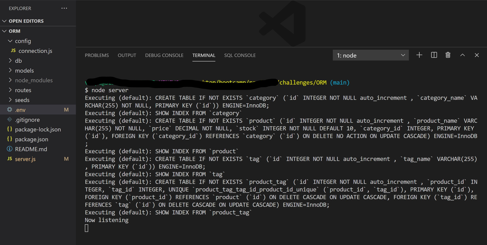

# Object-Relational-Mapping

## Functional Express.js API

## Description
-Program using Mysql, Node, Insomnia to run a backend database for an Ecommerce store.

### Add the database categories
-name, _MySQL username_, and _MySQL password_ to an environment variable file _.env_
and be able to connect to a database using _Sequelize_

### Enter schema and seed commands
- a development database is created and is seeded with test data

### Enter the command to invoke the application
- the server is started and the _Sequelize models_ are synced to the _MySQL_ database

### Open API GET routes
- in _Insomnia Core_ for *categories*, *products*, or *tags* and
 the data for each of these routes is displayed in a formatted *JSON*

### Test API POST, PUT, and DELETE routes 
- in _Insomnia Core_ and be able to successfully *create*, *update*, and *delete* data in database

 ## Installation
-The attached package.json outlines the required dependencies as inquirer, mysql, terminal-kit, and console.table. In the terminal, run `npm install --save` and it should add those automatically. Once your dependencies are installed, run the program with the command `node server.js`.

## Questions
-through this GitHub profile [github](#link).

## Lisence 

### seeding database:
 
### insomnia data:
 
 
 ### Demo: link https://github.com/VSLG2020/Object-Relational-Mapping.git
